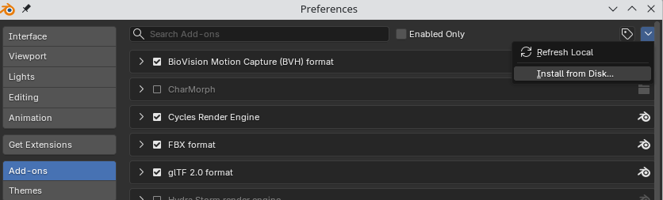
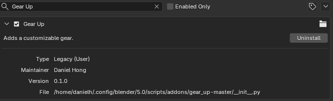
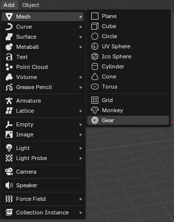

# Gear Up
Blender add-on for making a custom gear

# Installation

To install, first download the repository as a zip folder from the code's dropdown menu. *Do not unzip the contents.*

From Blender, navigate to `Edit > Preferences`.

In the left sidebar, select "Add-ons". From the top left dropdown, select "Install from Disk...".

A file dialog will pop-up. Navigate to and select the gear_up zip folder that you downloaded. The "Gear Up" add-on will automatically be enabled upon installation.

# Usage

To add a new gear, navigate to `Add > Mesh > Gear`. Note that this also works with the shortcut key `Ctrl + A`.

