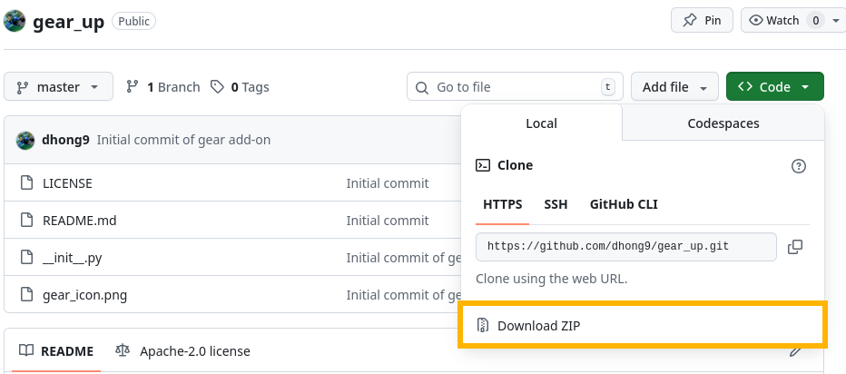
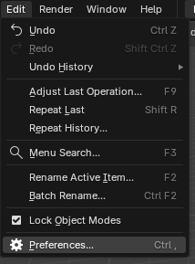

# Gear Up
Blender add-on for making a custom gear

# Installation

To install, first download the repository as a zip folder from the code's dropdown menu. *Do not unzip the contents.*

From Blender, navigate to `Edit > Preferences`.

